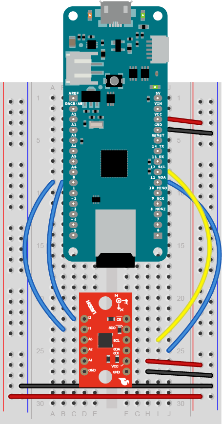

# MKR Zero and LIS3DH Accelerometer Motion Logger

This example logs small motions using an LIS3DH accelerometer and a MKR Zero. The LIS3DH has a tap detection feature that can be quite sensitive. In this example, two interrupt output pins of the accelerometer are connected to two digital inputs of the MKR Zero to detect when any tap is detected.

Figure 1 below shows the [Sparkfun LIS3DH breakout board](https://www.sparkfun.com/products/13963), but the [Adafruit LIS3DH breakout board](https://www.adafruit.com/product/2809) will work equally well. The only change is that the Sparkfun board's default I2C address is 0x19, while the Adafruit's is 0x18.

The program on the MKR Zero sleeps most of the time, using the LowPower library. The processor is woken up once a minute by the real-time clock, or whenever the external interrupt on digital input 1 is triggered by the accelerometer. When the processor wakes up, it writes a log entry to a file on its SD card using the SD library.

See these [instructions on datalogging on the MKR series](https://tigoe.github.io/DataloggingExamples/mkr-datalogging.html) boards for more on formatting the SD card and so forth. 

Figure 1 shows the connections between the MKR Zero and the accelerometer.

_Figure 1. LIS3DH accelerometer attached to a MKR Zero on a breadboard [Follow this link for the MKR breadboard layout](https://tigoe.github.io/DataloggingExamples/mkr-datalogging.html#Board-layout). The accelerometer's twelve pins are numbered in a U pattern from top left as follows:  I2, I2 (interrupt outputs); A3, A2, A1 (analog inputs); GND; then from bottom right: GND, Vcc, SDA/SDI, SCL, SDO, CS. Pin 7 (GND) is connected to the ground bus on the side of the breadboard. Pin 8 (Vcc) is connected to the voltage bus on the side of the breadboard. Pin 1 on the left (I2) and pin 2 (I1) are connected to the Arduino's digital pin 1 (physical pin 9 on the left). The accelerometer's pin 9 on the right (SDA) is connected to the MKR Zero's SDA pin (physical pin 20 on the right). The acclerometer's pin 10 (SCL) is connected to the MKR Zero's SCL pin (physical pin 21). Diagram made with Fritzing and Illustrator._