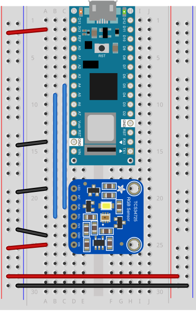
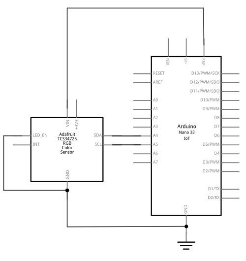

# Arduino HTTP Client for Logging

This Arduino-based client is written for the SAMD boards (MKR boards, Nano 33 IoT, Uno WiFi). It works with the [WiFiNINA](https://www.arduino.cc/reference/en/libraries/wifinina/) and [WiFi101](https://www.arduino.cc/reference/en/libraries/wifi101/) libraries, and can probably be adapted to other third-party WiFi libraries as well (not tested). It reads a [TCS34725 light sensor](https://ams.com/en/tcs34725) using [Adafruit's library for the sensor](https://github.com/adafruit/Adafruit_TCS34725), saves the readings in a JSON object using the [Arduino_JSON](https://github.com/arduino-libraries/Arduino_JSON) library, and makes HTTPS requests to a server once every two minutes. 

## The Code

The Arduino sketch for this circuit can be found at [this link]({{site.codeurl}}/WiFiDatalogger/DataLoggerHttpClientJSON/DataLoggerHttpClientJSON.ino). 

## The Circuit

This example uses a light and color sensor, the AMS [TCS34725](https://ams.com/tcs34725), using [Adafruit's library](https://github.com/adafruit/Adafruit_TCS34725) for it. It sends the illuminance levels in lux, and the color temperature levels in degrees Kelvin. You can replace it with any sensor you want, however.  

_Figure 1. Breadboard view of the Nano 33 IoT and TCS34725 sensor._

_Figure 2. Schematic view of the Nano 33 IoT and TCS34725 sensor._

Figures 1 and 2 show breadboard and schematic views of the circuit. The Nano's pins are numbered in a U shape from top left. The TCS34725's pins are on the left side of the board, and numbered from top to bottom. The Nano's 3.3V (physical pin 2) and ground (physical pin 14) are connected to the side bus rows of the breadboard in Figure 1, providing power and ground for the sensor as well (pins 7 and 6 on the sensor, respectively). The sensor's LED pin (pin 1) is also connected to ground. The SDA and SCL pins of the Nano (pins 8 and 9,respectively) are connected to the sensor's SDA and SCL pins (pins 3 and 4,respectively). The connections are detailed in Table 1 below. 

| Nano physical pin no.| Function | TCS34725 Physical pin | Function |
| :------------------: |:--------:| :--------------------:|:--------:|
| 2                    | 3.3V     | 7                     | Vin      |
| 8                    | SDA      | 3                     | SDA      |
| 9                    | SCL      | 4                     | SCL      |
| 14                   | GND      | 6                     | GND      |
| 14                   | GND      | 1                     | LED      |

In addition to the sensor data, the client also sends  the Arduino's MAC address as a client ID.  The id allows the server to filter out requests from clients that it doesn't already know. Any server on a public address always gets random requests, so it's a good idea to filter out the ones you don't want. The Arduino's WiFi MAC address does the job for this. 

## HTTP vs HTTPS
This Arduino client was originally to communicate with an HTTP/S server. Since the communications between server and client are all HTTP/S, the client can be adapted to communicate with other web-based apps with little change. See the notes on the [Google Sheets datalogger](google-sheets-datalogger) and [node.js datalogging server](node-datalogging-server) for details.