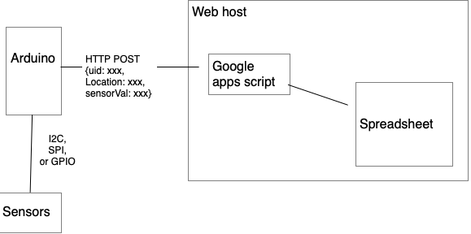

# Google Sheets Datalogger

The [Google Apps script]({{site.codeurl}}/WiFiDatalogger/google-sheets/datalogger/datalogger.gs) in this repository allows you to save data to a Google Sheets spreadsheet via HTTP. Arnab Chakravarty has a [tutorial on how it works](https://github.com/AbolTaabol/Arduino-GoogleSheet_Logger). For more background on Google Apps scripts, see [this link](https://developers.google.com/apps-script/reference/spreadsheet/spreadsheet-app). For reading on the web functions `doGet()` and `doPost()`, which are the main functions of this example, see [this link](https://developers.google.com/apps-script/guides/web).

The Arduino program which acts as a client to this script is at [this link]({{site.codeurl}}/WiFiDatalogger/DataLoggerHttpClientJSON).

The structure of the system is similar to [this node server](../node-datalogging-server/), and is diagrammed in Figure 1. The microcontroller client only has to change the URL and route that it's sending data to in order to send data to the Google apps script. The script writes to a Google Sheets spreadsheet that you need to create.



_Figure 1. System diagram of the Google apps script datalogger_

The Google Apps scripting API is just JavaScript. It lets you turn your spreadsheet into a web service quickly, and it gives you everything you might need to know about a given HTTP request in JSON, so it's easy to parse it out and put it into the cells of a spreadsheet. This lets you take advantage of all the things you can do with the data in a spreadsheet: sorting, graphing, filtering, and so forth.

The steps to  do this are as follows:

1. Set up a spreadsheet
2. Give the sheet some column headers. The names of these headers are the names for the data that you'll send from the client
4. Set up a script using the Extensions -> Apps Script menu
5. Write the script
6. Deploy it, giving anyone access
7. Note the relevant URLs and modify the Arduino client to contact them. 

## Set Up a Spreadsheet and Give Column Headers
Create a Google Sheet. Give it a name. Then give it some column headers. You might want to freeze the column header row using the View menu's Freeze -> one row selection as well.

This script that you'll add shortly works a bit differently from the [node.js server](../node-datalogging-server/) in this collection. The names of your client's sensor characteristics must match the column headings in the spreadsheet, except for one: `timestamp`. When a client sends a request, the script reads the names of the column headings in the spreadsheet and compares the characteristics' key names from the JSON object with the column headings. If the client's data has a characteristic matching one of the column heads, the script inserts the data into that column. For example, the Arduino client in this repository sends the following: `uid`,,`lux`,`ct`, `location`. So the Google sheet needs headings with the same names in order to capture it all. It fills in the `timestamp` field automatically, with the server's local time.

## Write a Google Apps Script
From the Extensions menu in Google Sheets, choose Apps Script. This will open a new tab with the Google Apps Script editor. Add the [google-sheets-datalogger](https://github.com/tigoe/DataloggingExamples/tree/main/WiFiDatalogger/google-sheets-datalogger) from this repository. You'll need to make a few modifications.

* Fill in the URL of your Google Sheet for the `SHEET_URL` variable. This tells the script where to find the sheet. 
* Add the MAC address of your Arduino device to the `knownClients` list. 

Now your script is ready for deployment. 

The script script in this collection will accept both GET and POST requests. For the POST request, the data format is as follows:
````js
{
   "uid": client ID (string),
   "location": client physical location (string),
   "lux": client lux reading (number),
   "ct": client color temperature reading (number)
}
````
As with the [node.js server](../node-datalogging-server/), you can also include any sensor characteristics that you want to add. The Arduino example in this collection sends illuminance and color temperature levels in lux (`lux`) and degrees Kelvin (`ct`), respectively, and the script looks for those characteristics as names of the column headings in the spreadsheet. 

## Deploy the Script

Save the script, then click the Deploy menu and choose New Deployment. Give this deployment a description (I usually use a version number, like 0.0.1). Choose who it will run as (you), then choose who has access (anyone). Then click Deploy. This will pop up a new window which includes the Deployment ID and the Web App URL. Copy the Deployment ID. You'll need to fill this into the Arduino client later. The Web App URL is how you'd access this script from a browser, or your Arduino client.

Every time you make a change to the script, you will need to save it and re-deploy. This will generate a new deployment ID, which means you'll need to change your clients as well. 

## Add the Google Script URL and Deployment ID to Your Client

To connect to the Google script from the Arduino client (or any client), you need to know the server address and the API route. The server address is always `script.google.com`. This is not the address of your actual spreadsheet, it's the address of the spreadsheet's script. 

The API route will depend on your script's deployment. The URL will change every time you re-deploy the script. To get this info, click the Deploy button in the script editor, choose Manage Deployments, and copy the Web URL of the current deployment. It will look something like this:

````
https://script.google.com/macros/s/DEPLOYMENT_ID/exec
````

* The server address: `script.google.com`
* The API route: `/macros/s/DEPLOYMENT_ID/exec`
* The deployment ID: `DEPLOYMENT_ID`

When you're writing a client, you'll need to change the deployment ID each time you re-deploy the Apps script, so it's often useful to make these three things separate, and change just the deployment ID each time. You can see this in action in the Arduino client. The server address and API route are initialized at the top of the script. The and deployment ID is stored in `arduino_secrets.h` as `SECRET_DEPLOYMENT_ID`. The `setup()` function replaces the substring `DEPLOYMENT` in the `route` variable with the `SECRET_DEPLOYMENT_ID` value. This way, you only need to change the deployment ID and the rest of the program adjusts as needed.

You can test your script using other client applications like [curl](https://curl.se/) or [Postman](https://www.postman.com/), to make testing easier. Here's a curl example that will call your script. It uses the -L flag to handle redirects, as described below. It sends the data using the -d flag, which forces it to send as POST. It uses the -H flag to include the `Content-type` header. Fill in your deployment ID for `DEPLOYMENT_ID` below:

````sh
curl -L -H 'Content-type: application/json' -d '{"uid": "AABBCCDDEEFF", "location": "window","lux": 400,"ct": 4200}' 'https://script.google.com/macros/s/DEPLOYMENT_ID/exec'
````

## Google Script Redirects

For security, Google scripts redirect to a one-time URL, generated with each new request, to respond to requests. Your HTTPS request will get a 302 response like this:

````sh
HTTP/2 302 
content-type: text/html; charset=UTF-8
access-control-allow-origin: *
cache-control: no-cache, no-store, max-age=0, must-revalidate
pragma: no-cache
expires: Mon, 01 Jan 1990 00:00:00 GMT
date: Mon, 24 May 2021 15:39:34 GMT
location: https://script.googleusercontent.com/macros/echo?user_content_key=XXXXXXXXXXXXXXXXXXXXX
````
You can see that one of the headers of the response is the location of the redirect URL. When you get that, you need to make your request again, using the server and route in the redirect location. 

The script will still add your data to the sheet if it's valid, even when it gives you a 302 response. So you can ignore the redirect if you want. If you want the full response from the server, however, the [DataLoggerHttpClientJSON](https://github.com/tigoe/DataloggingExamples/tree/main/WiFiDatalogger/DataLoggerHttpClientJSON) sketch will redirect. When the sketch gets the 302 response, it reads the headers, parses the new server and API route from the `location` field, makes the second request to that address, and gets the response back. 

For more on this, see the [Google script guide on redirects](https://developers.google.com/apps-script/guides/content#redirects). 

## Conclusion

Once you've got your client and Google Apps script in sync, you should see the spreadsheet automatically gaining rows with each new reading that the client takes. 


