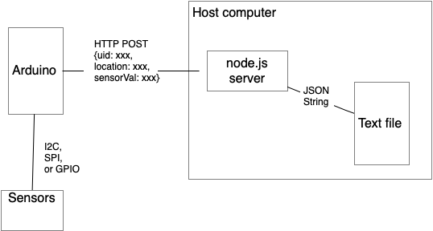

# Node.js Datalogger Server

This is a server that serves a webpage, its resources, and some data. It saves incoming records to a text file called `data.json`, and sends items from the file when requested. This file exists even when the server is not running. 

This server is written in [node.js](htps://nodejs.org). It has a RESTful API that accepts data formatted as a JSON string in the body of a POST request. The client should send sensor readings in a POST request with a JSON body to the server. The server writes the JSON string to a text file, as diagrammed in Figure 1.

The server program is written for HTTP, not HTTPS, but if it is served from [glitch.com](https://glitch.com), it will run as HTTPS. So the Arduino client in this repository is written as an HTTPS client too. If you prefer to run the servers on your own host and not use HTTPS, be sure to adjust the Arduino client accordingly.



_Figure 1. System diagram of the node datalogging server_
 
This server can be run on any host that can run node.js. You can see it running on [Glitch.com](https://glitch.com/) at [this link](https://glitch.com/edit/#!/tigoe-datalogger). It also includes a web-based client as a test example. 

## The API
- GET /uid/records/startTime/endTime - returns all records from startTime to endTime.
  * uid is a client ID, a 6-byte ID in hexadecimal format
  * startTime and endTime are in ISO8601 format (e.g. `2021-04-02T12:48:25Z`)

- POST /data - accepts a JSON record and adds it to the array

The JSON data in the POST request should look like this:
````js
{
   "uid": client ID (string),
   "location": client physical location (string),
   "lux": client lux reading (number),
   "ct": client color temperature reading (number)
}
````

You can also include any sensor characteristics that you want to add. The Arduino example in this collection sends light and color temperature levels in lux (`lux`) and degrees Kelvin (`ct`), respectively. The server doesn't check the names of the characteristics in the JSON data, so you can add anything you want.

## Running the Server Locally

If you want to run the server locally on your own computer, you'll need [node.js](https://nodejs.org) installed. Once you've got that done, clone this repository, and navigate to the `node-datalogging-server` directory on the command line. 

First, you need to install all the script's dependencies. They are described in the `package.json` file. Type the following on the command line to install them:

````sh
npm install
````
This will download all the libraries you need to run the script in a subdirectory called `node_modules`. To run the script, type: 

````sh
node server-filewriter.js
````
The server will run on port 8080 on your local machine. You can access it in a web browser, go to `http://localhost:8080`.

To access your local server from the Arduino client in this repository, you'll need the IP address of your computer. Change the `server` variable to the IP address of your comouter and change the `route` variable to `/data`. Change the `WiFiSSLClient` declaration to `WiFiClient` and change the `port` variable to `8080` which is the port on which this server is listening. 

## The Clients

There are two clients here:
* `index.html`, an HTML page in `/public` that sends and reads data. It reads data only from page load until the current time.
* [DataLoggerHttpClientJSON.ino]({{site.codeurl}}/WiFiDatalogger/DataLoggerHttpClientJSON/DataLoggerHttpClientJSON.ino) - an Arduino client that reads from a light sensor and sends to the server 