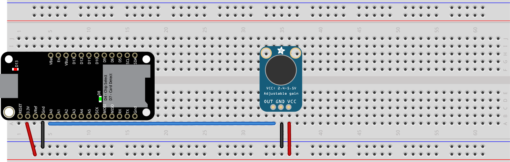
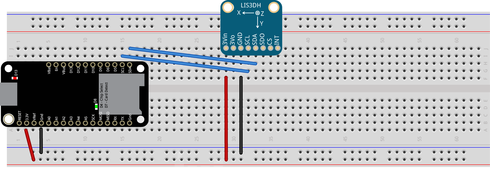

<!DOCTYPE html>
<html>

  <head>
    <meta charset='utf-8'>
    <meta http-equiv="X-UA-Compatible" content="chrome=1">
    <meta name="description" content="DataloggingExamples : Feather M0 Adalogger">

    <link rel="stylesheet" type="text/css" media="screen" href="stylesheets/stylesheet.css">

    <title>Introduction to the Feather M0 Adalogger</title>
  </head>

  <body>

    <!-- HEADER -->
    

        <header class="inner">
          <a id="forkme_banner" href="https://github.com/tigoe/DataloggingExamples">View on GitHub</a>

          <h1 id="project_title">DataloggingExamples</h1>
          <h2 id="project_tagline">Examples of Datalogging Using Microcontrollers</h2>

            <section id="downloads">
              <a class="zip_download_link" href="https://github.com/tigoe/DataloggingExamples/zipball/master">Download this project as a .zip file</a>
              <a class="tar_download_link" href="https://github.com/tigoe/DataloggingExamples/tarball/master">Download this project as a tar.gz file</a>
            </section>
        </header>
    

    <!-- MAIN CONTENT -->
    

      <section id="main_content" class="inner">
        <h1>
<a id="introduction" class="anchor" href="#introduction" aria-hidden="true"></a>Introduction to the Feather M0 Adalogger</h1>

In this workshop you'll be working with the Adafruit Feather M0 Adalogger microcontroller board. This board uses a Cortex ARM M0+, which is the same processor as the Arduino Zero. That means it's Arduino-compatible, and a very capable processor for datalogging.  The <a href="https://learn.adafruit.com/adafruit-feather-m0-adalogger?view=all">Adafruit Guide to the Feather M0 Adalogger</a> is a thorough introduction. This page is a quick-reference only.

<h3>Functions of the Board</h3>

  The Feather M0 Adalogger can read various sensors using its digital and analog inputs and its asynchronous serial and I2C communications pins. It can also read and write from an attached SD card. It can communicate with a personal computer via USB as well. It has a Lithium-Poly (LiPo) battery charger built-in so you can charge a battery while you're programming, then unplug and run off the battery independently. There's also a built-in real-time clock that can keep accurate time and two built-in LEDs that you can use to indicate what's going on.

  Below is the pin diagram for the board. Many of the pins have multiple functions. For the purposes of this workshop, the important pins are as follows:

<ul>
  <li><strong>Digital I/O pins (D4-D13)</strong> You can attach digital inputs (switches and pushbuttons) and digital outputs (LEDs, etc) to these pins to control them using the digitalRead() and digitalWrite() commands</li>
  <li><strong>Analog input pins (A0-A5)</strong> You can attach sensors that produce a changing analog voltage to these pins and read them using the analogRead() command. Potentiometers, light sensors, distance sensors, and force sensors are good examples of this kind of sensor.</li>
  <li><strong>SPI pins (MISO, MOSI, SCK)</strong> The pins labeled MISO, MOSI, and SCK are for synchronous serial communication using the SPI protocol. They control the SD card. You shouldn't use them for other inputs or outputs</li>
  <li><strong>I2C pins (SDA, SCL)</strong> The pins labeled SDA and SCL are for synchronous serial communications using the I2C protocol. These are used for communicating with sensors like the LIS3DH accelerometer and others.</li>
</ul>

 
<em>Adalogger M0 pin diagram. <a href="images/adafruit_products_p2796.png">Click here</a> for a more detailed version. For more on the pin functions, see <a href="https://learn.adafruit.com/adafruit-feather-m0-adalogger?view=all#pinouts">this link.</a></em>

<h3>Setting up the board</h3>

To set up the board, you need to download the Arduino IDE version 1.6.7 and install the boards definition as shown on the <a href="brown-workshop.html#getting-started">intro page for the workshop</a>. Once you've got the necessary software installed, plug the board into a soldereless breadboard as shown below, then plug it into your computer's USB port and you're ready to go. 

To test your board, click the Tools Menu --> Boards option, and choose "Adafruit Feather M0 (Native USB Port)". Then click the Tools menu --> Port option, and choose the port with "(Adafruit Feather M0)" at the end of it. THen click the File Menu --> Examples option --> Basics --> Blink to open a sketch that will blink the red LED on the board. Click the Upload button from the toolbar and you should see the sketch upload and the red LED will begin to blink.

 
<em>The Arduino IDE toolbar</em>

<h3>Connecting the Sensors</h3>

Each of the examples in this repository uses a different sensor with the Feather, and you'll need to wire the sensor to the board before uploading the code that reads it. Disconnect your board from power before wiring your sensors. Below are the wiring diagrams for each sensor.

<h4>Pushbutton</h4>

<em>Pushbutton connected to a Feather. Button output pin is attached to digital pin 5 of the microcontroller.</em>

<h4>Potentiometer</h4>

<em>Potentiometer connected to a Feather. Potentiometer output pin is attached to analog pin 0 of the microcontroller.</em>

<h4>DHT11 Temperature and Humidity Sensor</h4>

<em>DHT11 Temp/Humidity sensor connected to a Feather. Sensor output pin is attached to digital pin 5 of the microcontroller.</em>
 
<a href="https://github.com/tigoe/DataloggingExamples/blob/master/Columbia_Brown_Center_2016/DHT11/DHT11.ino">Code example</a>
 
<a href="https://github.com/tigoe/DataloggingExamples/blob/master/Columbia_Brown_Center_2016/TempHumidityLogger/TempHumidityLogger.ino">Code example - Temp/Humidity Datalogger</a>

<h4>Microphone</h4>

<em>Max4466 Microphone connected to a Feather. Microphone output pin is attached to analog pin 0 of the microcontroller.</em>
 
<a href="https://github.com/tigoe/DataloggingExamples/blob/master/Columbia_Brown_Center_2016/Loudness/Loudness.ino">Code example - Loudness</a>
 
<a href="https://github.com/tigoe/DataloggingExamples/blob/master/Columbia_Brown_Center_2016/FrequencyMeter/FrequencyMeter.ino">Code example - Frequency Meter</a>

<h4>Light Sensor</h4>

<em>GA1A12S202 Log-scale light sensor connected to a Feather. Sensor output pin is attached to analog pin 0 of the microcontroller.</em>
 
<a href="https://github.com/tigoe/DataloggingExamples/blob/master/Columbia_Brown_Center_2016/GA1AS202LightSensor/GA1AS202LightSensor.ino">Code example - Read Lux</a>

<h4>Accelerometer</h4>

<em>LIS3DH accelerometer connected to a Feather. Sensor SDA and SCL pins are attached to SDA and SCL pins of the microcontroller.</em>
 
<a href="https://github.com/tigoe/DataloggingExamples/blob/master/Columbia_Brown_Center_2016/LIS3DHAccelerometer/LIS3DHAccelerometer.ino">Code example - Read g's</a>

<h4>Ultrasonic Distance Ranger</h4>

<em>Maxbotix LV-EZ0 Ultrasonic Distance Ranger connected to a Feather. Sensor output pin is attached to analog pin 0 of the microcontroller.</em>

<h4>PIR Motion Sensor</h4>

<em>PIR motion sensor connected to a Feather. Sensor output pin is attached to digital pin 5 of the microcontroller.</em>
 
<a href="https://github.com/tigoe/DataloggingExamples/blob/master/Columbia_Brown_Center_2016/PIR_sensor/PIR_sensor.ino">Code example</a>

<h3>All Code Examples</h3>

There are additional code examples for the se sensors, and for the SD card and real-time clock at <a href="https://github.com/tigoe/DataloggingExamples/tree/master/Columbia_Brown_Center_2016">this link</a>.
      </section>
    

    <!-- FOOTER  -->
    

      <footer class="inner">
        
DataloggingExamples maintained by <a href="https://github.com/tigoe">tigoe</a>

        
Published with <a href="https://pages.github.com">GitHub Pages</a>

      </footer>
    

  </body>
</html>
