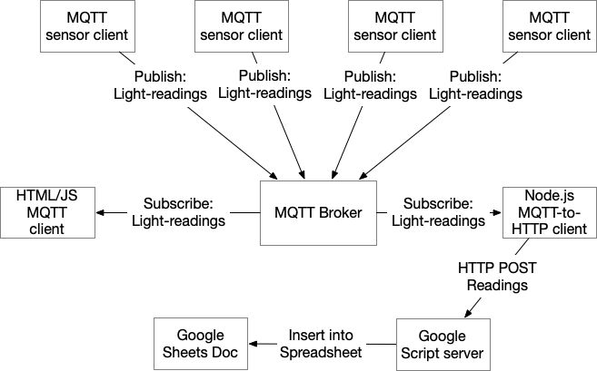

# Datalogging to a Server via MQTT and WiFi

The datalogging application described here logs data to a server via WiFi using a network-enabled microcontroller as a datalogging client. It is based on the [WiFi datalogging application](wifi-datalogger), but instead of HTTP, the microcontroller clients use the [Message Queueing Telemetry Transfer (MQTT)](https://tigoe.github.io/mqtt-examples/) protocol.

These examples should all work on the network-enabled MKR boards, along with the Nano 33 IoT and other SAMD-based boards which have network capability. They can likely work on Espressif-based boards (ESP32, ESP8266) with some modification.

This application uses [shiftr.io](https://shiftr.io/try) as its MQTT broker, but it should work with any MQTT broker by changing the address and crednetials.

## What is MQTT? 

MQTT, is a lightweight IP-based messaging protocol designed for communication between sensors, controllers, and other devices. It’s designed to support equipment that may not always be online, or that have limited processing power. Unlike HTTP, it's message-based, so once a client sends a message, there's no need to wait for a response. MQTT server programs are called **brokers**. A broker keeps track of messages from clients. Clients can **publish** messages to a broker on a given topic, or can **subscribe** to an existing topic to see messages from other clients. 

## MQTT Datalogger System Diagram

Figure 1 shows the system diagram for this datalogger. There are several microcontroller-based sensor clients, shown at the top of the diagram that all publish messages to a topic called `light-readings` on an MQTT broker. There are two other clients: a browser-based client written in HTML and JavaScript, and a server-based client written in node.js. The HTML/JS client subscribes to the `light-readings` topic and displays any incoming messages in the browser. The node.js client also subscribes to the `light-readings` topic. When it receives a new message, it makes a HTTP POST request to a Google Script server that posts to a Google Sheets spreadsheet. This Google script/spreadsheet combination is the same as what's used in the [Google Sheets Datalogger example](https://tigoe.github.io/DataloggingExamples/wifi-datalogger#google-sheets-datalogger). 

The advantage of using MQTT for this datalogging application is that the microcontrollers don't have to wait for a reply from the server, and can therefore be inactive and using less energy more of the time. It's also simpler to program than an HTTP client.

## MQTT Microcontroller Clients

There are several MQTT microcontroller clients in this repository. Though they are all written with a specific sensor in mind, you could change the sensor out for any sensor, and modify the code accordingly. The MQTT part of the code would remain the same.

* [DataLoggerMqttJSON](https://github.com/tigoe/DataloggingExamples/tree/main/MQTTDatalogger/DataLoggerMqttJSON) - the simplest of the clients. Reads a sensor and sends an MQTT message as a JSON object. 
* [DataLoggerMqttJSONRTC](https://github.com/tigoe/DataloggingExamples/tree/main/MQTTDatalogger/DataLoggerMqttJSONRTC) - similar to the first client, but uses the alarm function of the RTCZero library to control when messages are sent. 
* [DataLoggerMqttJSONWithStatusCheck](https://github.com/tigoe/DataloggingExamples/tree/main/MQTTDatalogger/DataLoggerMqttJSONWithStatusCheck) - Based on the first client, and also listens on a UDP port for specific commands that let you check the status of the controller or restart it.
* [DataLoggerMqttSubTopics](https://github.com/tigoe/DataloggingExamples/tree/main/MQTTDatalogger/DataLoggerMqttSubTopics) - sends the sensor properties as individual values that are subtopics of the `light-readings` topic rather than as a single JSON object. 

## MQTT JavaScript Clients

As mentioned in the system diagram description above, there are two JavaScript clients, one for the browser, and one for a server running node.js. The [browser client](https://github.com/tigoe/DataloggingExamples/tree/main/MQTTDatalogger/node-mqtt-client/public) can run in a browser with or without a server, as all the code runs in-browser only. It subscribes to the `light-readings` topic and reports any new messages in the HTML. It's included as the public HTML of the node client so that you can use them together if you want. They work well on [glitch.com](https://glitch.com).

The [node.js server client](https://github.com/tigoe/DataloggingExamples/tree/main/MQTTDatalogger/node-mqtt-client/) subscribes to the `light-readings` topic and sends an HTTP POST request to a Google script to add the readings to a spreadsheet. The Google script/sheets part of this application is identical to the [Google Sheets Datalogger example](https://tigoe.github.io/DataloggingExamples/wifi-datalogger#google-sheets-datalogger) in this repository.

