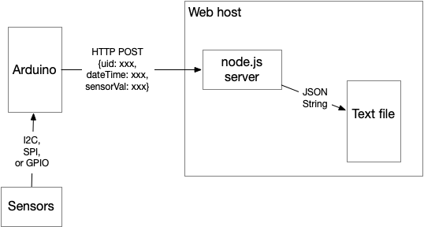
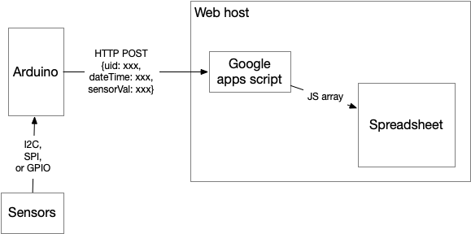

# Datalogging to a Server via WiFi

The examples described here log data to a server via WiFi using a network-enabled client. These should all work on the network-enabled MKR boards, along with the Nano 33 IoT and other SAMD-based boards which have network capability. They can likely work on Espressif-based boards (ESP32, ESP8266) with some modification.

[This collection](https://github.com/tigoe/DataloggingExamples/tree/master/WiFiDatalogger) includes [ArduinoHttpClient](https://www.arduino.cc/reference/en/libraries/arduinohttpclient/) examples along with [node.js](https://nodejs.org/) server scripts. There are also instructions for how to log data to a Google Sheets spreadsheet using [Google Apps script](https://developers.google.com/apps-script/reference/spreadsheet/spreadsheet-app), thanks to Arnab Chakravarty. 

For other WiFi  and ArduinoHttpClient examples, see [this repository](https://tigoe.github.io/Wifi101_examples/). For other Node examples, see [this repository](https://github.com/tigoe/NodeExamples/).

## Arduino HTTP Client for Logging

The central app in this collection is the [DataLoggerHttpClientJSON](https://github.com/tigoe/DataloggingExamples/tree/master/WiFiDatalogger/DataLoggerHttpClientJSON). It is an Arduino-based client, written for the SAMD boards (MKR boards, Nano 33 IoT). It reads a sensor, saves the readings in a JSON object using the [Arduino_JSON](https://github.com/arduino-libraries/Arduino_JSON) library, and makes HTTPS requests to a server once a minute. 

This example uses a light and color sensor, the AMS [TCS34725](https://ams.com/tcs34725), using [Adafruit's library](https://github.com/adafruit/Adafruit_TCS34725) for it. It sends the illuminance levels in lux, and the color temperature levels in degrees Kelvin. You can replace it with any sensor you want, however.  

In addition to the sensor data, the client also sends a timestamp, generated from the Arduino's [realtime clock](https://www.arduino.cc/reference/en/libraries/rtczero/), and a unique ID (uid), read from the board's [ECCx08 crypto chip](https://www.arduino.cc/reference/en/libraries/arduinoeccx08/). 

The realtime clock allows you to timestamp the data on the client. If you're using a board without a realtime clock, you could timestamp the data on the server side instead. 

The uid allows the servers to filter out requests from clients that it doesn't already know. You could replace this with the MAC address of your WiFi radio or a randomly assigned unique ID number if you're not using the crypto chip.

There are a few variations on the client in this collection:
* [DataLoggerHttpClientJSON](https://github.com/tigoe/DataloggingExamples/tree/master/WiFiDatalogger/DataLoggerHttpClientJSON) - the original, written for the node.js server, but works with the Google Sheets script as well
* [DataLoggerHttpClientJSON_redirect](https://github.com/tigoe/DataloggingExamples/tree/master/WiFiDatalogger/DataLoggerHttpClientJSON_redirect) - a variation that handles the Google apps script redirect. See the section on the Google Sheets Datalogger for more on this. 

## Datalogging Server Applications

This client was originally written to communicate with an HTTP server written in node.js. Since the communications between server and client are all HTTP, it can be adapted to communicate with other web-based apps with little change.  

### Node.js Datalogger



_Figure 1. System diagram of the node datalogging server_

The [node-datalogging-server](https://github.com/tigoe/DataloggingExamples/tree/master/WiFiDatalogger/node-datalogging-server) has a RESTful API that accepts data formatted as a JSON string in the body of a POST request. The client microcontroller reads its sensors, then sends the readings in a POST request with a JSON body to the server. One version of the server writes the JSON string to a text file, as diagrammed in Figure 1. 

You can also read all the records of the server by making a GET request.

The JSON data in the POST request should look like this:
````js
{ "uid": client ID, a 9-byte ID in hexadecimal format,
  "date": date in ISO8601 format}
````
The [ISO8601 time format](https://en.wikipedia.org/wiki/ISO_8601) looks like this: `2021-05-24T10:31:14Z`

You can also include any sensor characteristics that you want to add. The Arduino examples in this collection send light and color temperature levels in lux (`lux`) and degrees Kelvin (`ct`), respectively. The server doesn't check the names of the characteristics in the JSON data, so you can add anything you want. 

This server can be run on any host that can run node.js. You can see it running on [Glitch.com](https://glitch.com/) at [this link](https://glitch.com/edit/#!/tigoe-datalogger). It also includes a web-based client, as a test example. 

The node.js client filters requests by checking a uid in the JSON body of the POST request. If the UID that the client sends doesn't match one of the ones in a list called `knownClients`, the server responds with a 403 error and the data is not saved. You'll need to fill in the uid of your microcontroller for this to work. You can get it using the [ECCx08 crypto chip](https://www.arduino.cc/reference/en/libraries/arduinoeccx08/) library like so:

````arduino
  // start the crypto chip and use its serial number
  // as a unique ID:
  ECCX08.begin();
  String uid = ECCX08.serialNumber();
  Serial.println(uid);
  ````

There are two versions of the server, one of which saves the incoming data in an array, and another which appends the data to a text file. Both of these are simpler substitutes for a database. The data from [server-filewriter](https://github.com/tigoe/DataloggingExamples/blob/master/WiFiDatalogger/node-datalogging-server/server-fileWriter.js) script is more persistent because it's saved to a separate file. The data from the basic [server](https://github.com/tigoe/DataloggingExamples/blob/master/WiFiDatalogger/node-datalogging-server/server.js) script will be lost when you stop the script running.  

### Google Sheets Datalogger



_Figure 2. System diagram of the Google apps script datalogger_


[Google Apps script](https://developers.google.com/apps-script/reference/spreadsheet/spreadsheet-app) allows you to save data to a Google Sheets spreadsheet via HTTP. Arnab Chakravarty has a [tutorial on how it works](https://github.com/AbolTaabol/Arduino-GoogleSheet_Logger). For more background on Google Apps scripts, see the link above, or [this link](https://developers.google.com/apps-script/guides/web) which explains the web functions `doGet()` and `doPost()`, which are the main functions of this example. 

The structure of the system is similar to the node server, and is diagrammed in Figure 2. The microcontroller only has to change the URL and API route that it's sending data to, in order to send data to the Google apps script. The script takes the place of the node.js server, and writes to a Google Sheets spreadsheet instead of a text file.

What's great about the Google Apps scripting API is that it's just JavaScript, it lets you give your spreadsheet into a web service quickly,   and it gives you everything you might need to know about a given HTTP request in JSON, so it's easy to parse it out and put it into the cells of a spreadsheet. This lets you take advantage of all the things you can do with the data in a spreadsheet: sorting, graphing, filtering, and so forth.

Briefly, the steps to get started are as follows:

1. Set up a spreadsheet
2. Give the sheet some column headers
3. Publish it to the web as a web page using the File -> Publish for Web menu
4. Set up a script using the Tools -> Script Editor menu
5. Write the script
6. Deploy it
7. Note the relevant URLs and modify the Arduino client to contact them. 

The [google-sheets-datalogger](https://github.com/tigoe/DataloggingExamples/tree/master/WiFiDatalogger/google-sheets-datalogger) script in this collection will accept both GET and POST requests. For the POST request, the data format is the same as the node.js server above:

````js
{ "uid": client ID, a 9-byte ID in hexadecimal format,
  "date": date in ISO8601 format}
````
As with the node.js server, you can also include any sensor characteristics that you want to add. The Arduino examples in this collection send light and color temperature levels in lux (`lux`) and degrees Kelvin (`ct`), respectively, and the script looks for those characteristics as names of the column headings in the spreadsheet. 

This script works a bit differently from the node.js server above. The names of your client's sensor characteristics must match the column headings in the spreadsheet.  When a client sends a request, the script reads the names of the column headings in the spreadsheet and compares the characteristics' key names from the JSON object with the column headings. If the client's data has a characteristic matching one of the column heads, the script inserts the data into that column. 

#### Google Script URLs

To connect to the Google script from the Arduino clients, you need to change the server address and the API route. The server address is always `script.google.com`. This is not the address of your actual spreadsheet, it's the address of the spreadsheet's script. 

The API route will depend on your script's deployment. To get it, click the Deploy button in the script editor, choose "Manage Deployments, and copy the Web URL of the current deployment. It will look something like this:

````
https://script.google.com/macros/s/XXXXXX/exec
````
You can see the server address mentioned above in this URL. The API route is the part after the server; in this case, it's `macros/s/XXXXX/exec`. It will be different for your script. Copy it, and paste it into the `route` global variable in the [DataLoggerHttpClientJSON](https://github.com/tigoe/DataloggingExamples/tree/master/WiFiDatalogger/DataLoggerHttpClientJSON) or [DataLoggerHttpClientJSON_redirect](https://github.com/tigoe/DataloggingExamples/tree/master/WiFiDatalogger/DataLoggerHttpClientJSON_redirect) sketch. Now your Arduino should be able to connect to the script.

#### Google Script Redirects

For security, Google scripts redirect to a one-time URL, generated with each new request, to respond to requests. Your HTTPS request will get a 302 response like this:

````sh
HTTP/2 302 
content-type: text/html; charset=UTF-8
access-control-allow-origin: *
cache-control: no-cache, no-store, max-age=0, must-revalidate
pragma: no-cache
expires: Mon, 01 Jan 1990 00:00:00 GMT
date: Mon, 24 May 2021 15:39:34 GMT
location: https://script.googleusercontent.com/macros/echo?user_content_key=XXXXXXXXXXXXXXXXXXXXX
````
You can see that one of the headers of the response is the location of this URL. When you get that, you need to make your request again, using the server and route in the redirect location. 

The script will still add your data to the sheet if it's valid, even when it gives you a 302 response. So you can use the [DataLoggerHttpClientJSON](https://github.com/tigoe/DataloggingExamples/tree/master/WiFiDatalogger/DataLoggerHttpClientJSON) and accept the 302 response if you want. The sketch will still work with the script, even if it's not reading the whole response. 

If you want the full response from the server, however, try the [DataLoggerHttpClientJSON_redirect](https://github.com/tigoe/DataloggingExamples/tree/master/WiFiDatalogger/DataLoggerHttpClientJSON_redirect) sketch. When this sketch gets the 302 response, it reads the headers, parses the new server and API route from the `location` field, makes the second request to that address, and gets the response back. 

For more on this, see the [Google script guide on redirects](https://developers.google.com/apps-script/guides/content#redirects). 


