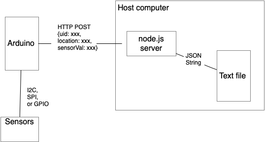

# Node.js Datalogger



_Figure 1. System diagram of the node datalogging server_

This [node-datalogging-server](https://github.com/tigoe/DataloggingExamples/tree/main/WiFiDatalogger/node-datalogging-server) is written in [node.js](htps://nodejs.org). It has a RESTful API that accepts data formatted as a JSON string in the body of a POST request. The client should send sensor readings in a POST request with a JSON body to the server. The server writes the JSON string to a text file, as diagrammed in Figure 1. 

You can also read all the records from the server by making a GET request.

The JSON data in the POST request should look like this:
````js
{
   "uid": client ID (string),
   "location": client physical location (string),
   "lux": client lux reading (number),
   "ct": client color temperature reading (number)
}
````

You can also include any sensor characteristics that you want to add. The Arduino example in this collection sends light and color temperature levels in lux (`lux`) and degrees Kelvin (`ct`), respectively. The server doesn't check the names of the characteristics in the JSON data, so you can add anything you want. 

This server can be run on any host that can run node.js. You can see it running on [Glitch.com](https://glitch.com/) at [this link](https://glitch.com/edit/#!/tigoe-datalogger). It also includes a web-based client, as a test example. 